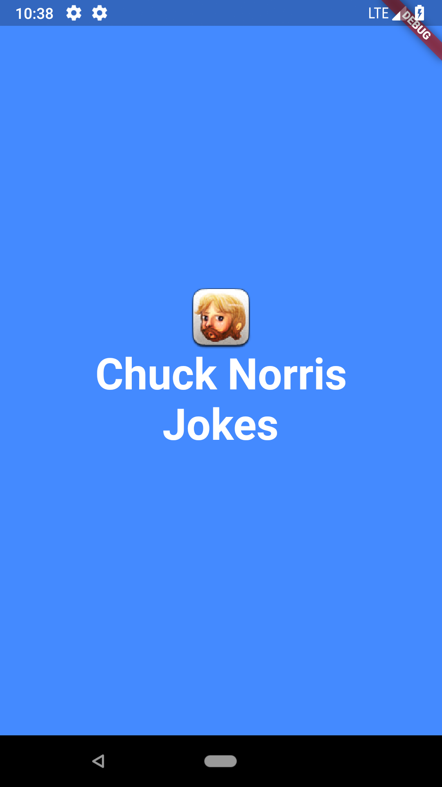
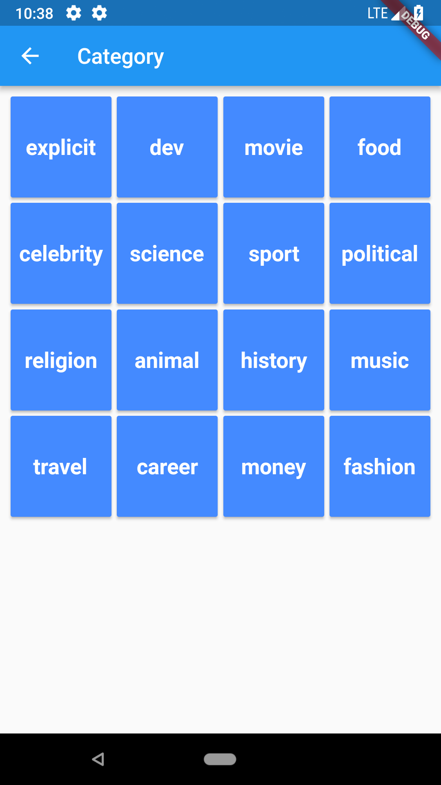
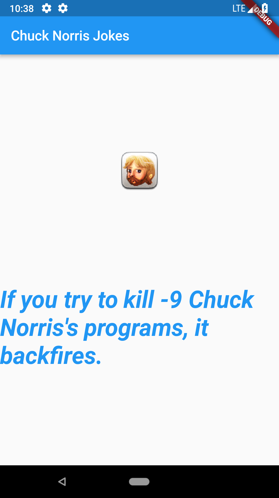

# Chuck Norris Jokes

A simple Flutter project using [Chuck Norris API](https://api.chucknorris.io/). The goal of the project is to showcase how to consume API from the web.

## Screens
1. Flash 
 (It is basic Flash activity to start the application)
2. Categories 
(It fetch and displays the categories for all jokes)
1. Joke 
(It displays a Chuck Norris jokes from the category you have chosen)

